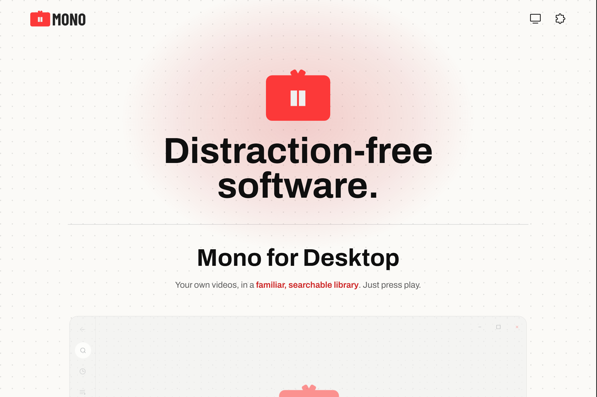
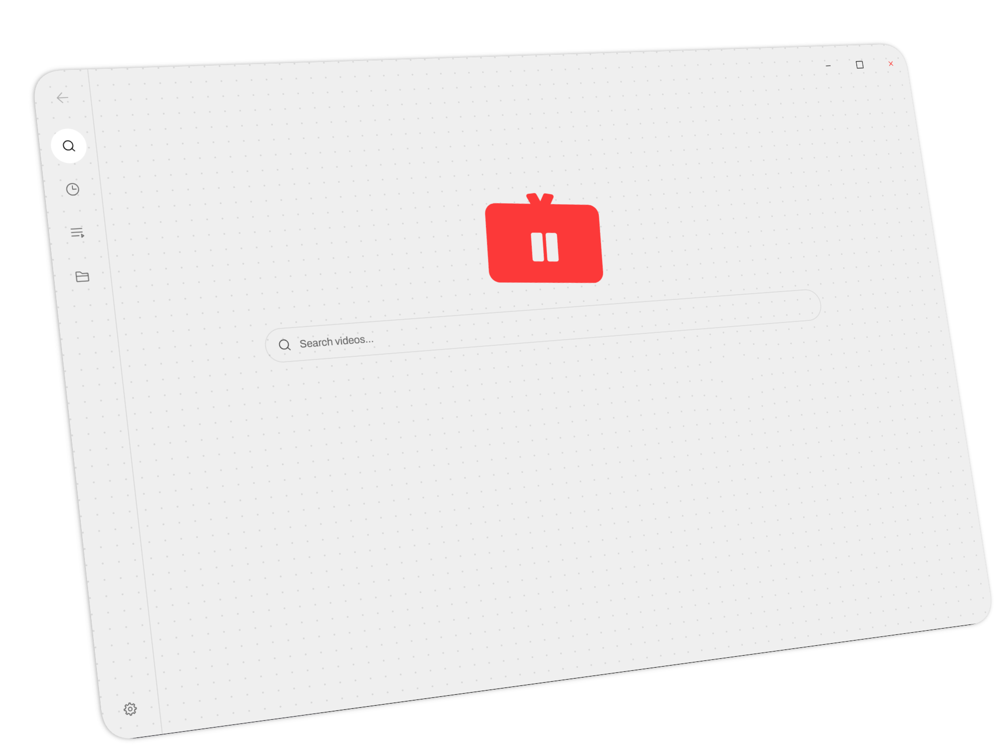
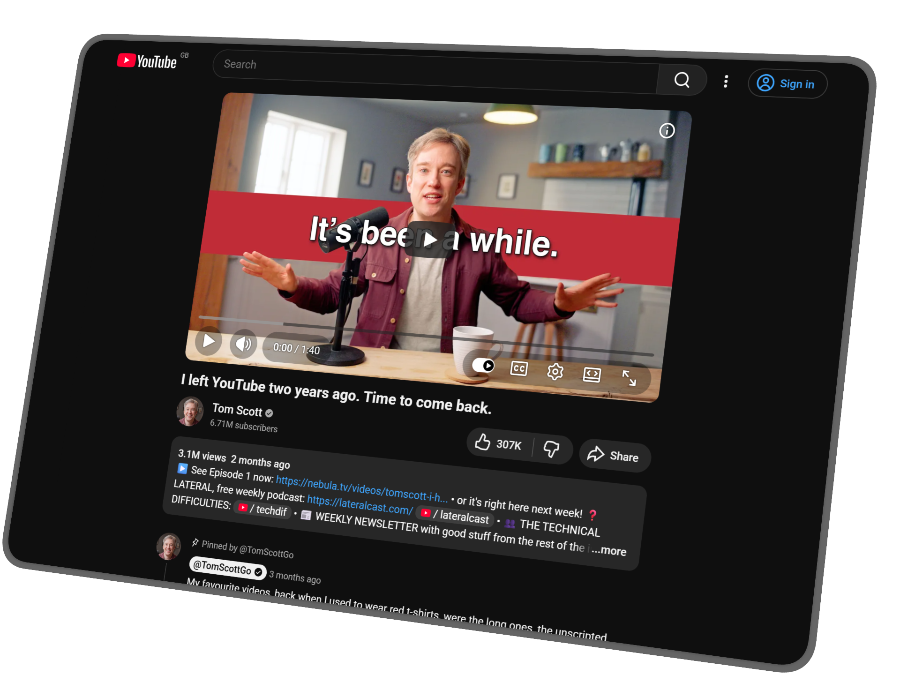

  

  Distraction-free software for watching, organising, and focusing on video.

  

## What Is Mono?

Mono is a small collection of distraction-free tools for video.

**Mono for Desktop** is a desktop app for watching the videos already on your computer. Point it at your folders and it gathers them into one library you can search, preview, and play. Nothing is moved or uploaded; everything stays on your machine.

**Mono for YouTube** is a browser extension that removes recommendations, visual clutter, and attention traps from YouTube while keeping the parts you still need: the player, search, descriptions, comments, and account controls.

## Get Mono

| Product | Link |
| --- | --- |
| 🖥️ Mono for Desktop | [Download for Windows](https://github.com/Aadam-Gafar/Mono-Public-Dist/releases/download/v1.0.0/Mono.Video.Library_1.0.0_x64_en-US.msi) |
| 🌐 Mono for YouTube (Chrome) | [Install from the Chrome Web Store](https://chromewebstore.google.com/detail/focus-for-youtube/nppiofogichmlkadpbpkpojpidedifeh) |
| 🦊 Mono for YouTube (Firefox) | [Install from Firefox Add-ons](https://addons.mozilla.org/en-US/firefox/addon/mono-extension/) |
| 🛠️ Mono for YouTube (GitHub) | [Source code](https://github.com/Aadam-Gafar/Mono-for-YouTube) |

## Mono for Desktop

  

- Gathers the videos on your computer into one searchable library.
- Plays almost any format and resumes where you left off.
- Previews videos when you hover over them.
- Keeps everything on your machine without moving your files.

## Mono for YouTube

  

- Remove recommendations and other attention traps.
- Keep the video player, search, description, comments, and account controls.
- Run quietly without tracking you or adding extra clutter.
- Make YouTube feel more intentional.

## Contact

Questions, feedback, or support: [contact@monoapp.uk](mailto:contact@monoapp.uk)
